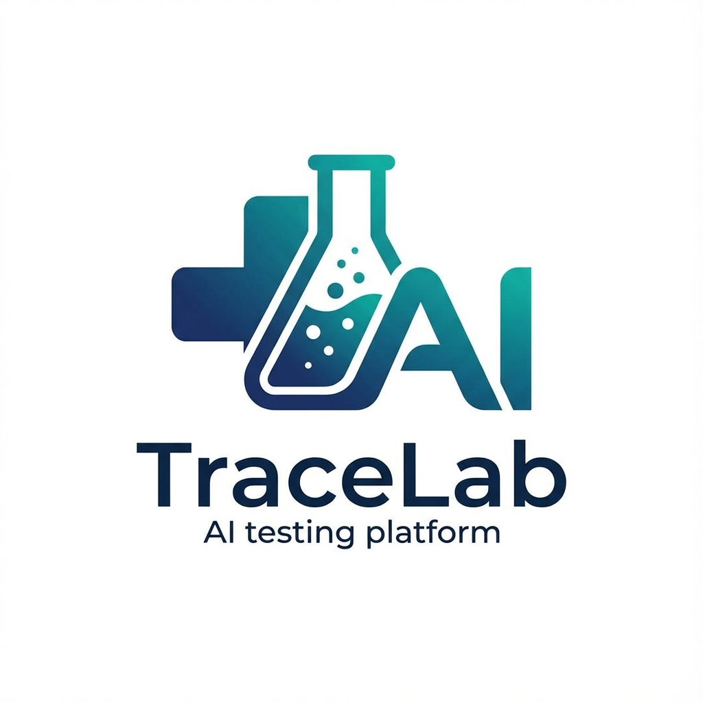

# TraceLab - Medical Device Testing & Compliance Platform



TraceLab is a comprehensive medical device testing and compliance platform designed to help healthcare software developers ensure regulatory compliance, maintain traceability, and automate test generation for FDA, IEC, and HIPAA standards.

## 🏥 Overview

TraceLab addresses critical challenges in medical device software development by providing:

- **AI-Powered Requirements Extraction** from code repositories and documentation
- **Automated Test Case Generation** with executable Python/JavaScript test scripts
- **Regulatory Compliance Validation** against FDA 21 CFR Part 11, IEC 62304, ISO 13485, and HIPAA
- **Traceability Matrix** linking requirements to code implementations and test cases
- **Real-time Test Execution** in isolated environments
- **GitHub Integration** for seamless repository analysis

## ✨ Key Features

### 🔍 Repository Analysis
- Fetch and analyze GitHub repositories
- Extract code structure, functions, and documentation
- Identify security anti-patterns and compliance gaps
- Generate comprehensive code digests for AI analysis

### 🤖 AI-Powered Intelligence
- **Dual AI Support**: Google Gemini API and local Ollama (MedGemma)
- **Requirements Extraction**: Automatically identify functional, security, and compliance requirements
- **Context-Aware Analysis**: Cross-reference code with provided requirements documents
- **Smart Test Generation**: Create targeted, executable test cases

### 🧪 Test Automation
- **Multi-Language Support**: Python (pytest) and JavaScript (Node.js)
- **Isolated Execution**: Safe test environment with virtual environments
- **Real-time Feedback**: WebSocket-based live test execution monitoring
- **Dependency Management**: Automatic package installation and environment setup

### ⚖️ Compliance & Validation
- **FDA 21 CFR Part 11**: Electronic records and signatures compliance
- **IEC 62304**: Medical device software lifecycle validation
- **ISO 13485**: Quality management for medical devices
- **HIPAA/ISO 27001**: Healthcare data protection standards

### 🔗 Traceability & Reporting
- **Requirements Traceability**: Link requirements to code and tests
- **Compliance Scoring**: Automated compliance status calculation
- **Detailed Reports**: Export capabilities for regulatory submissions
- **Activity Tracking**: Audit trail of all analysis and testing activities

## 🏗️ Architecture

```
┌─────────────────┐    ┌──────────────────┐    ┌─────────────────┐
│   Frontend      │    │     Backend      │    │    Database     │
│   React/TS      │◄──►│   FastAPI/Python │◄──►│   Supabase      │
│   Vite          │    │   WebSocket      │    │   PostgreSQL    │
│   TailwindCSS   │    │   uvicorn        │    │   Row Level Sec │
└─────────────────┘    └──────────────────┘    └─────────────────┘
         │                       │                       │
         │              ┌──────────────────┐              │
         └──────────────►│   External APIs  │◄─────────────┘
                        │   • GitHub API   │
                        │   • Firebase     │
                        │   • Gemini AI    │
                        │   • Ollama       │
                        └──────────────────┘
```

### Technology Stack

**Frontend:**
- **React 19** with TypeScript
- **Vite** for build tooling
- **TailwindCSS** for styling
- **React Router** for navigation
- **Lucide React** for icons

**Backend:**
- **FastAPI** Python web framework
- **WebSocket** for real-time communication
- **Uvicorn** ASGI server
- **Asyncio** for concurrent operations

**Database & Storage:**
- **Supabase** (PostgreSQL with Row Level Security)
- **Firebase Authentication** (primary)
- **Supabase Database** (user data sync)

**External Services:**
- **GitHub API** for repository analysis
- **Google Gemini AI** for requirements extraction
- **Ollama** with MedGemma model for local AI processing

## 🚀 Quick Start

### Prerequisites

- **Node.js** 18+ and npm
- **Python** 3.9+ and pip
- **Git** for repository access
- **Supabase account** for database
- **Firebase project** for authentication
- **GitHub Personal Access Token** (optional, for API rate limits)

### Environment Variables

Create a `.env` file in the project root:

```bash
# Firebase Configuration
VITE_FIREBASE_API_KEY=your_firebase_api_key
VITE_FIREBASE_AUTH_DOMAIN=your_project.firebaseapp.com
VITE_FIREBASE_PROJECT_ID=your_project_id
VITE_FIREBASE_STORAGE_BUCKET=your_project.appspot.com
VITE_FIREBASE_MESSAGING_SENDER_ID=your_sender_id
VITE_FIREBASE_APP_ID=your_app_id

# Supabase Configuration
VITE_SUPABASE_URL=https://your_project.supabase.co
VITE_SUPABASE_ANON_KEY=your_anon_key

# GitHub API (Optional - for higher rate limits)
VITE_GITHUB_TOKEN=your_github_token

# AI Configuration
VITE_GEMINI_API_KEY=your_gemini_api_key
```

### Installation

1. **Clone the repository:**
```bash
git clone https://github.com/your-org/tracelab.git
cd tracelab
```

2. **Install frontend dependencies:**
```bash
npm install
```

3. **Install backend dependencies:**
```bash
pip install -r requirements.txt
```

4. **Set up Supabase database:**
   - Create a new Supabase project
   - Run the migration files in `migrations/` directory
   - Configure Row Level Security policies

### Running the Application

**Start the backend server:**
```bash
cd server
python main.py
# Server runs on http://localhost:8000
```

**Start the frontend development server:**
```bash
npm run dev
# Frontend runs on http://localhost:5173
```

### Production Build

```bash
npm run build
```

## 📊 Database Schema

The application uses the following main tables:

### Users
- **Purpose**: Sync Firebase authentication with Supabase
- **Fields**: id, email, name, avatar_url, provider, email_verified

### Projects
- **Purpose**: GitHub repositories under analysis
- **Fields**: id, name, github_url, owner, repo_name, digest_text, user_id

### Requirements
- **Purpose**: Extracted requirements from code and documents
- **Fields**: req_id, content, source, type, priority, compliance_tags, risk_level, rationale, project_id, user_id

### Test Cases
- **Purpose**: Generated executable test cases
- **Fields**: test_case_id, title, type, expected_result, compliance_tag, test_script, test_filename, language, dependencies, target_files, repo_url, requirement_id, user_id

### Compliance Issues
- **Purpose**: Identified compliance gaps and violations
- **Fields**: standard, severity, message, file_path, project_id, user_id

## 🔧 Configuration

### AI Provider Setup

**Option 1: Google Gemini (Recommended)**
1. Get API key from [Google AI Studio](https://makersuite.google.com/app/apikey)
2. Add to `.env`: `VITE_GEMINI_API_KEY=your_key`
3. Select "Gemini 2.0 Flash" in the UI

**Option 2: Local Ollama (MedGemma)**
1. Install Ollama: `curl -fsSL https://ollama.ai/install.sh | sh`
2. Pull MedGemma model: `ollama pull alibayram/medgemma:4b`
3. Select "MedGemma (Ollama)" in the UI

### GitHub Integration

**For Public Repositories:**
- No authentication required
- Limited by GitHub API rate limits (60 requests/hour)

**For Private Repositories:**
1. Create GitHub Personal Access Token
2. Add to `.env`: `VITE_GITHUB_TOKEN=your_token`
3. Increases rate limits to 5,000 requests/hour

## 📱 Usage Guide

### 1. Creating a New Analysis

1. **Navigate to Dashboard** and click "New Analysis"
2. **Select AI Provider** (Gemini or MedGemma)
3. **Enter GitHub URL** (format: `https://github.com/user/repo`)
4. **Upload Requirements PDF** (optional, for cross-reference)
5. **Start Analysis** and monitor progress

### 2. Analyzing Results

**Dashboard Overview:**
- View project statistics and compliance scores
- Monitor recent activity and analysis history
- Quick access to different modules

**Requirements Management:**
- Browse extracted requirements with metadata
- Filter by type, priority, and compliance tags
- Link requirements to test cases

**Test Cases:**
- View generated executable test scripts
- Run tests in isolated environments
- Monitor test execution results

**Traceability Matrix:**
- Visualize requirement-to-code-to-test mappings
- Identify coverage gaps
- Export traceability reports

**Compliance Reports:**
- Review identified compliance issues
- Filter by severity and regulatory standard
- Generate compliance status reports

### 3. Running Tests

Tests are automatically generated and can be executed through the web interface:

1. Navigate to Test Cases page
2. Select a test case
3. Click "Run Test"
4. Monitor real-time execution via WebSocket
5. Review results and logs

## 🔌 API Reference

### WebSocket Endpoints

**Test Execution (`/ws/run-tests`)**
```typescript
interface TestRunRequest {
  repo_url: string;
  branch?: string;
  test_script: {
    filename: string;
    content: string;
  };
  dependencies?: string[];
  repo_files?: {
    path: string;
  }[];
}
```

**Response Format:**
```typescript
interface TestRunResponse {
  type: 'status' | 'log' | 'output' | 'complete';
  status?: 'passed' | 'failed' | 'error';
  message?: string;
  results?: {
    passed: number;
    failed: number;
    errors: number;
    total: number;
    test_details: Array<{
      name: string;
      status: string;
    }>;
  };
}
```

### REST Endpoints

The application primarily uses Supabase for data operations. Key operations include:

- **Projects**: CRUD operations via Supabase client
- **Requirements**: Query and management
- **Test Cases**: Generation and execution tracking
- **Compliance Issues**: Validation and reporting

## 🧪 Testing

### Frontend Testing
```bash
npm run test
```

### Backend Testing
```bash
cd server
pytest tests/
```

### End-to-End Testing
```bash
npm run test:e2e
```

## 🚀 Deployment

### Frontend Deployment (Vercel/Netlify)
```bash
npm run build
# Deploy dist/ folder to your hosting provider
```

### Backend Deployment (Railway/Heroku/AWS)
```bash
cd server
# Configure environment variables
# Deploy using your preferred platform
```

### Environment Variables for Production
Ensure all environment variables are properly configured:
- Firebase configuration for authentication
- Supabase URL and keys for database
- GitHub token for API access
- Gemini API key for AI processing

## 🤝 Contributing

We welcome contributions! Please follow these guidelines:

1. **Fork the repository**
2. **Create a feature branch**: `git checkout -b feature/amazing-feature`
3. **Commit your changes**: `git commit -m 'Add amazing feature'`
4. **Push to the branch**: `git push origin feature/amazing-feature`
5. **Open a Pull Request**

### Development Guidelines

- **Code Style**: Follow ESLint and Prettier configurations
- **TypeScript**: Maintain strict typing throughout
- **Testing**: Add tests for new features
- **Documentation**: Update README and code comments
- **Security**: Follow security best practices

### Issue Reporting

Please use the GitHub issue tracker to report:
- 🐛 Bug reports
- ✨ Feature requests
- 📚 Documentation improvements
- ⚡ Performance issues

## 📋 Compliance & Security

### Regulatory Compliance
This tool is designed to help with compliance but is not a substitute for professional regulatory advice. Always consult with qualified regulatory professionals for:
- FDA submissions
- CE marking processes
- Risk management files
- Quality system procedures

### Data Security
- **User Data**: Protected by Firebase Authentication and Supabase RLS
- **Repository Access**: Uses GitHub API with optional token authentication
- **AI Processing**: Data sent to Google Gemini or processed locally via Ollama
- **Test Execution**: Isolated environments for security

### Privacy Considerations
- No persistent storage of repository contents beyond analysis
- AI processing follows provider privacy policies
- User authentication data managed by Firebase
- Database access controlled by Row Level Security

## 📄 License

This project is licensed under the MIT License - see the [LICENSE](LICENSE) file for details.

## 🙏 Acknowledgments

- **Google Gemini AI** for powerful language model capabilities
- **Ollama** for local AI processing with MedGemma
- **Supabase** for robust database and authentication services
- **Firebase** for reliable user authentication
- **GitHub** for repository access and API services
- **Medical Device Community** for compliance requirements and feedback

---

**Built with ❤️ for the medical device development community**

*Ensuring safe, compliant, and traceable medical device software*
